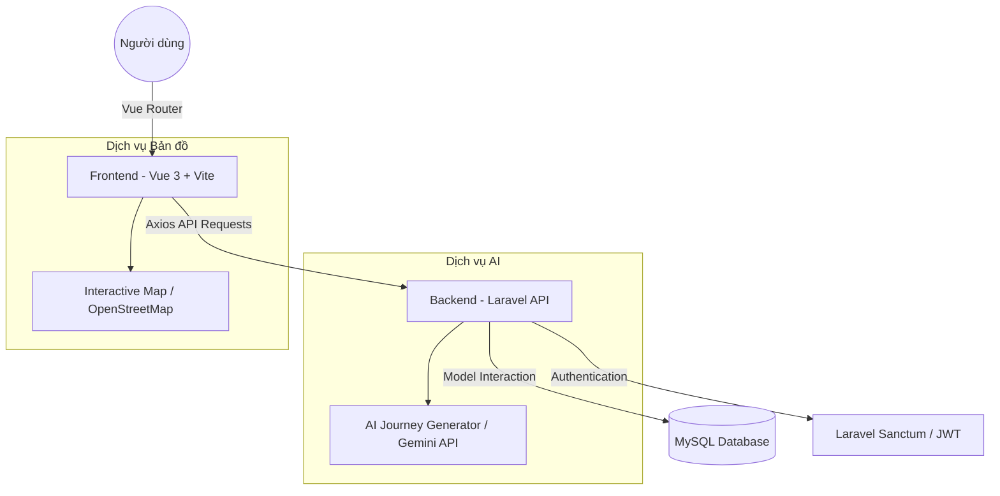

# 🌍 Smart Travel - AI-Powered Journey Planner
> Nền tảng lập kế hoạch du lịch thông minh tích hợp Trí tuệ nhân tạo (AI), mang lại trải nghiệm khám phá thế giới đỉnh cao.

[](https://vuejs.org/)
[](https://vitejs.dev/)
[](https://laravel.com/)

---

## 🌟 Tổng quan dự án

**Smart Travel** là giải pháp hội tụ giữa công nghệ du lịch và trí tuệ nhân tạo. Hệ thống không chỉ đơn thuần là một trang web đặt tour, mà là một "trợ lý hành trình" thực thụ, giúp người dùng:
- 🤖 **Lên kế hoạch bằng AI:** Tự động thiết lập lịch trình chi tiết dựa trên ngân sách, sở thích và điểm đến.
- 📊 **So sánh Tour thông minh:** Đối chiếu trực quan các gói tour để tìm ra lựa chọn tối ưu nhất.
- 👥 **Quản lý nhóm:** Cộng tác cùng bạn bè, người thân để cùng xây dựng hành trình mơ ước.
- 🗺️ **Bản đồ tương tác:** Theo dõi lộ trình trực quan với tích hợp tọa độ thực tế.

> [!TIP]
> Hệ thống sử dụng giao diện **Neo-Futuristic** với hiệu ứng **Glassmorphism** và các vi-hoạt ảnh (micro-animations) mượt mà, mang lại cảm giác công nghệ tương lai trên từng tương tác.

---

## 🏗️ Kiến trúc hệ thống



---

## 🚀 Tính năng nổi bật

### 1. Phân hệ Khách hàng (Customer)
- **AI Planner:** Nhập điểm đến, ngày đi, ngân sách -> Nhận lịch trình chi tiết từng buổi.
- **Hành trình nhóm:** Tạo nhóm, mời thành viên và phân quyền quản lý kế hoạch chung.
- **Yêu thích & Đánh giá:** Lưu trữ các địa điểm ấn tượng và chia sẻ trải nghiệm cá nhân.
- **Quản lý Hóa đơn:** Theo dõi trạng thái thanh toán và lịch sử giao dịch tour.

### 2. Phân hệ Quản trị (Admin)
- **Dashboard 360°:** Thống kê doanh thu, tỷ lệ lấp đầy tour và dữ liệu khách hàng theo thời gian thực.
- **Quản lý Tour & Lịch khởi hành:** Kiểm soát linh hoạt các gói du lịch và thời gian vận hành.
- **Hệ thống Phân quyền (RBAC):** Quản lý chi tiết chức vụ và chức năng của từng tài khoản admin.
- **Cấu hình AI & Tag:** Tinh chỉnh các tham số AI và hệ thống phân loại địa điểm.

---

## 🛠️ Thiết lập dự án

### 1. Yêu cầu hệ thống
- **Node.js:** >= 18.x
- **NPM:** >= 9.x
- **Backend:** Đã cài đặt và chạy tại `http://127.0.0.1:8000`

### 2. Cài đặt Frontend
```bash
# Clone repository
git clone https://github.com/TrieuMonSt/DoAnTotNghiepFE.git

# Di chuyển vào thư mục
cd DoAnTotNghiepFE

# Cài đặt dependencies
npm install

# Chạy ứng dụng (Development)
npm run dev
```

### 3. Build sản xuất
```bash
# Build production bundle
npm run build

# Preview kết quả build
npm run preview
```

---

## 🗺️ Bản đồ Route chính

| Khu vực | Route | Chức năng |
| :--- | :--- | :--- |
| **Public** | `/` | Trang chủ & Lên kế hoạch nhanh |
| | `/dang-nhap` | Đăng nhập Đa vai trò (Customer/Admin) |
| **Khách hàng** | `/khach-hang/ke-hoach` | Quản lý lịch trình cá nhân |
| | `/khach-hang/nhom-hanh-trinh` | Quản lý cộng tác nhóm |
| **Quản trị** | `/dashboard` | Trung tâm điều hành số liệu |
| | `/admin/tour` | Quản lý kho Tour |
| | `/admin/phan-quyen` | Thiết lập quyền hạn hệ thống |

---

## 📄 Giấy phép & Bản quyền
Dự án được phát triển cho mục đích Đồ án Tốt nghiệp.
Distributed under the **MIT License**.

**Được xây dựng với ❤️ bởi Nhóm Phát triển Smart Travel.**
